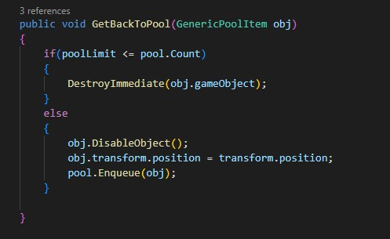
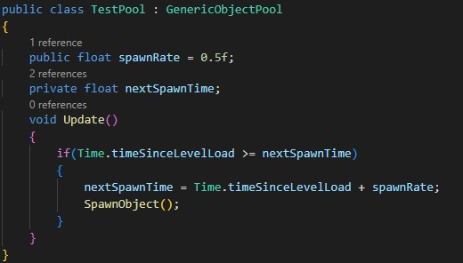
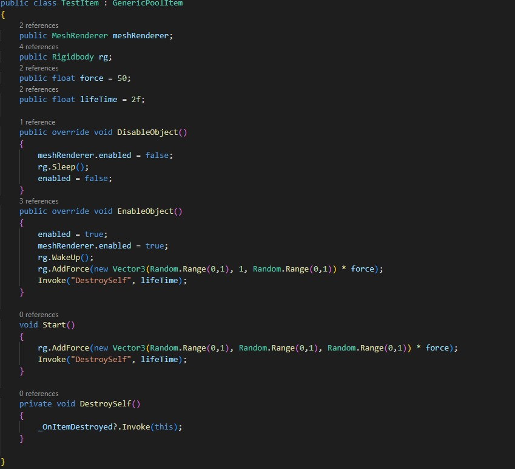

# Unity-DynamicObjectPool
Dynamic Object Pool Class For Optimization

https://youtu.be/tIeIr-YuR2w

In this project you can use any class with pooling and you can set a limit to pool in the inspector.
whenever pool has been full, after that if objects still try to back pooling they will be destroyed.

Example Implementation:

